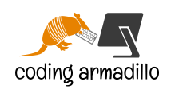
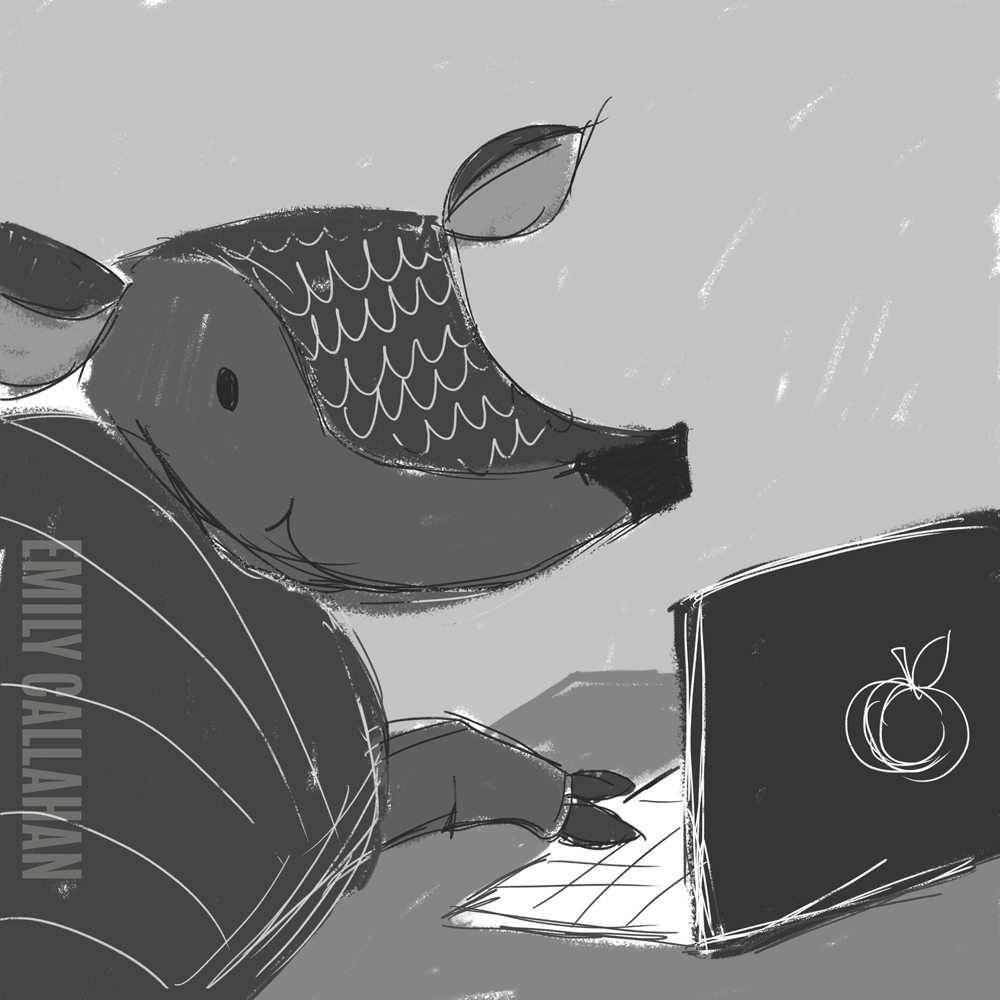
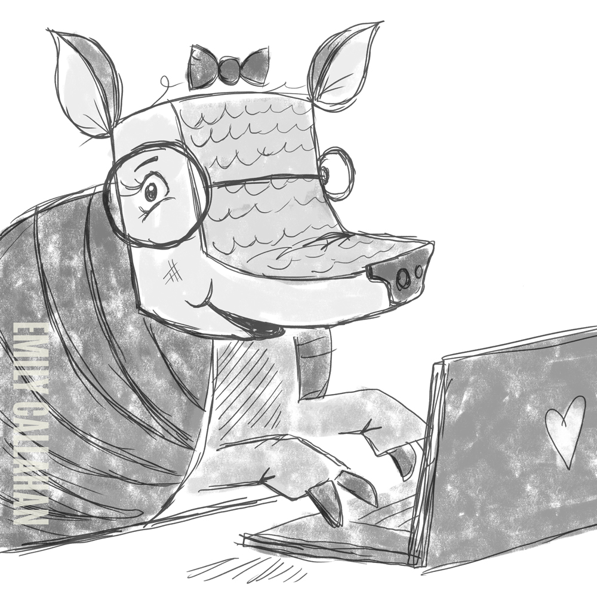
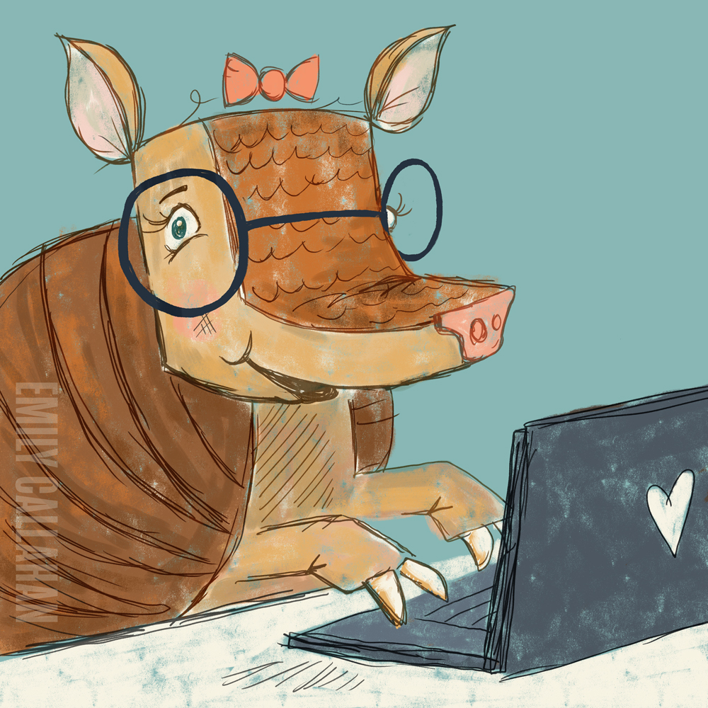
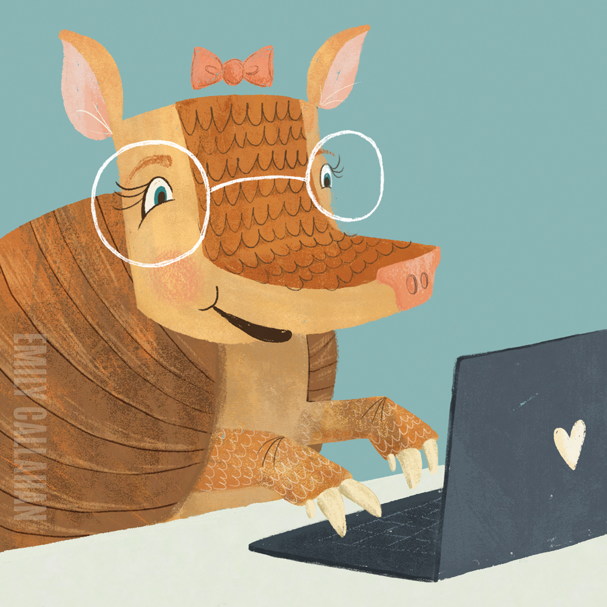

After saying "Hello World" I struggled to make myself a pretty profile picture.
Being no designer I tried to use an [online tool](https://www.freelogodesign.org/) to visualize my idea.
And it came out like the following. :(

Luckily I stumbled across [Emily](https://emcallahan.com/)'s [dribbble](https://dribbble.com/emily-callahan) profile and loved her illustrative version of armadillo at first sight.
We got in touch and she agreed to make me a profile picture.
We started with a sketch.

We exchanged ideas and got a new sketch.

Then lovely colors were added!

Finally I have an awesome profile picture!

If you need some artwork done, please [contact](https://emcallahan.com/contact) Emily. She's amazing!
